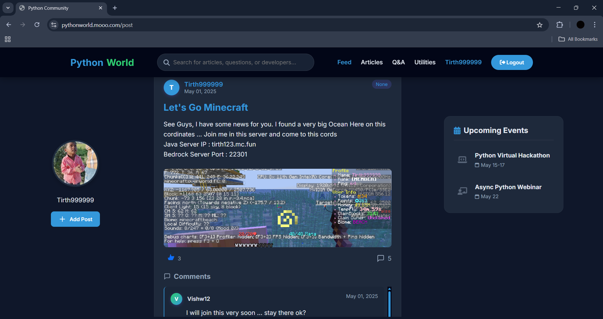
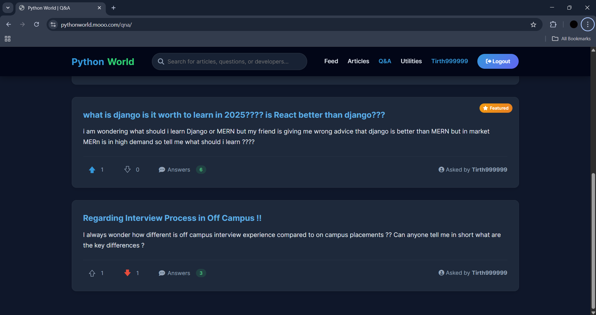
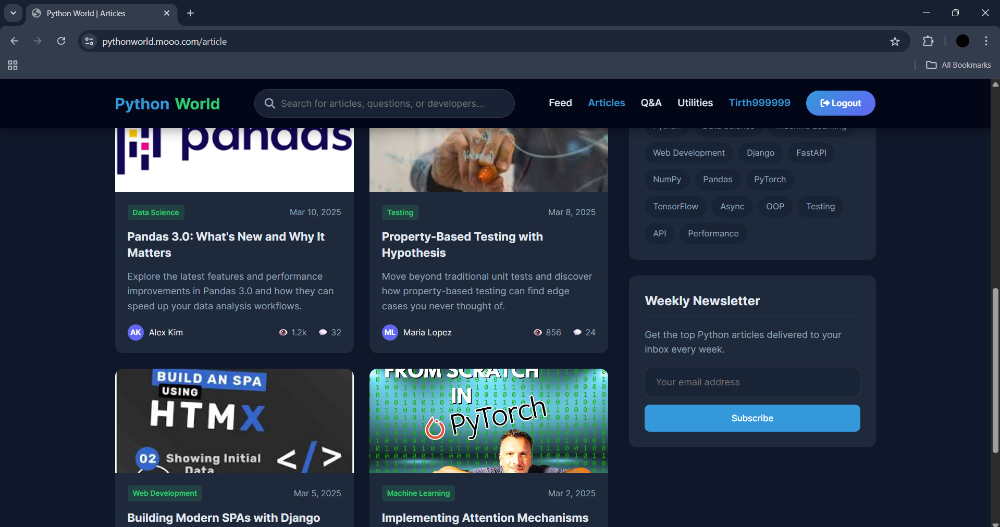
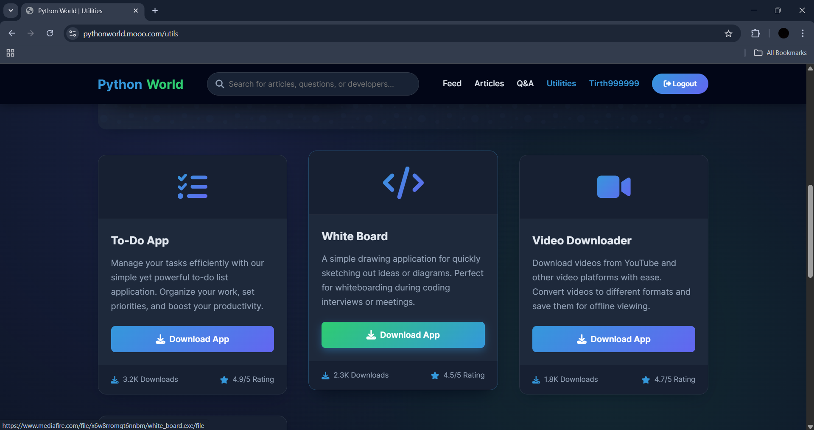
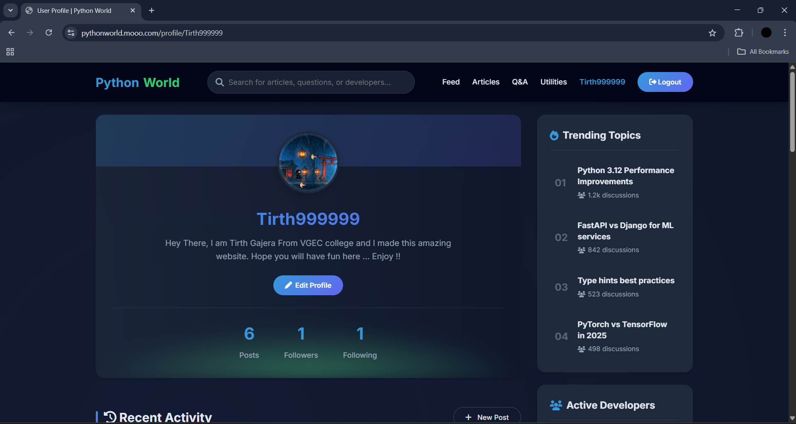
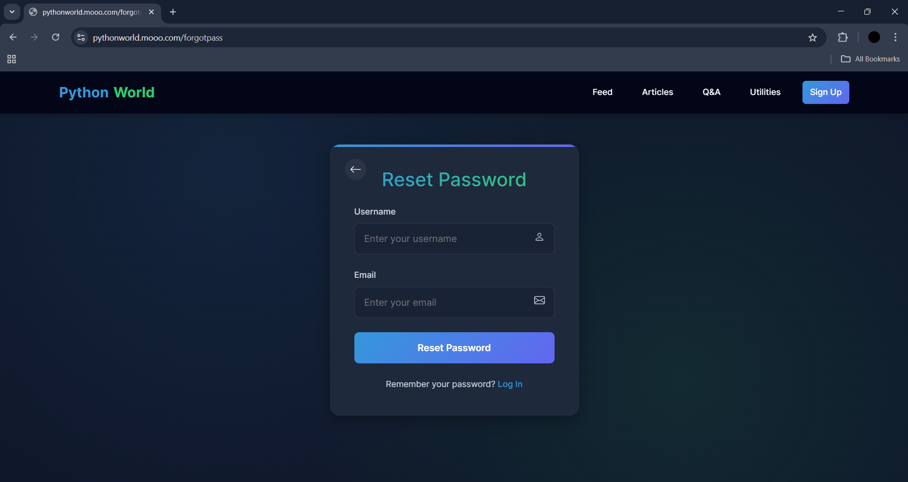
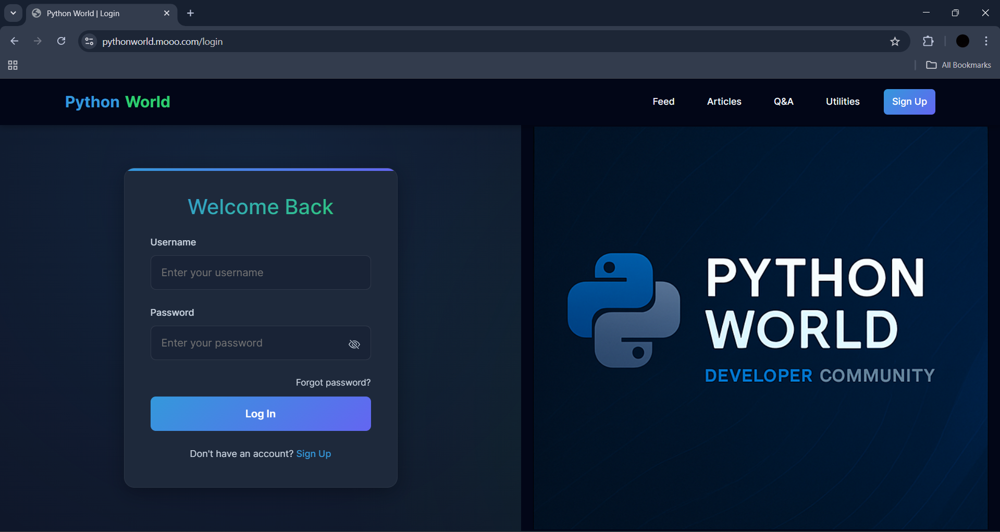

# 🌍 Python World – Developer Community Platform

  

  

**Python World** is an interactive platform for developers and non-developers alike to learn, share, and grow in the world of Python programming. Built with **Django**, **MongoDB**, and a host of innovative features, this platform provides posts, Q&A, articles, and Python utilities that make learning and sharing fun and interactive.

---

## 🛠️ Key Features

### 📝 **Post Section**

- Users can **create, share, like, and comment** on posts related to Python programming and tech topics.
  
- Supports rich **text formatting** and the ability to attach **images** to posts.
  
- Engage with others by commenting and liking posts, fostering a **collaborative environment**.

### ❓ **Q&A Section**

- Users can **ask** questions and receive **answers** from other community members.
  
- Each question can be **upvoted** or **downvoted** based on its usefulness.
  
- Encourages knowledge sharing and community engagement.

### 📰 **Articles Section**

- The platform regularly adds **technology-related articles** to keep the community informed.
  
- Articles focus on **coding tips**, **tech news**, and **Python-related topics**.
  
- Users can comment on and share their opinions on articles.

### 🧑‍💻 **Utilities Section**

- Provides a collection of **Python-based utility applications** (.exe format) like:
  
  - **To-Do App**
    
  - **Video Downloader**
    
  - **Whiteboard App**
  
- These utilities are designed to make everyday tasks easier using Python.

### 👥 **User Interaction Features**

- **Follow** and **Followed** users to stay updated with their posts and activities.
  
- **Custom Authentication** system using **MongoDB** for user management (no Django default auth).
  
- Admins can manage both **users and posts**, offering a seamless control experience.

---

## 🚀 Deployment

Python World is deployed on **Google Cloud**, using **NGINX** as a reverse proxy for production-ready scalability and reliability.

- The platform is live and accessible through the web.
  
- Hosted on **Google Cloud** to ensure availability and performance.
  
- **NGINX** handles incoming requests and acts as a reverse proxy, ensuring optimal performance.

---

## 📝 Future Features

- **AI Chatbot**: Implement a Python-powered chatbot to assist users with quick coding-related queries.
  
- **Interactive Articles**: More interactive and community-driven article discussions.
  
- **Developer Contributions**: A feature allowing external developers to suggest new utilities in the **Utilities Section**.
  
- **Daily Python News**: Add a news feature powered by AI to provide daily Python-related news updates.

---

### 🌐 There you Go !!

- **Enjoy the journey with Python World**
  
- **Link** : https://pythonworld.mooo.com

## 🧑‍💻 Contributors

**Python World** was built by a passionate team:

- **Tirth** ([@Tirth](https://github.com/TIrth999999))
  
- **Vishw** ([@Vishw](https://github.com/vishw596))
  
- **Sahil** ([@Sahil](https://github.com/SheikhSahil26))

We thank you for supporting us and contributing to the Python World project!

---

## 📸 Screenshots

Here are some visual snapshots of what Python World looks like:

- **Homepage**:
  

- **User Dashboard**:
  

  
- **Forgot Password?**:
  

- **Login & SignUp**:

---

## 📞 Contact

For any queries or suggestions, please feel free to reach out to us at:

- **Email**: official.pythonworld@gmail.com

---
